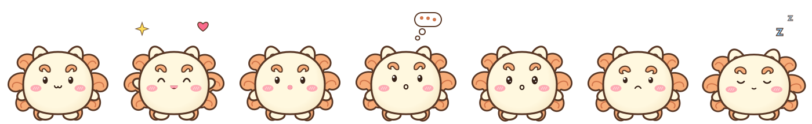

# shisa-pet

A tiny Shisa that lives on your Linux desktop and chats with you, powered by Claude.



Shisa sits on top of your windows, blinks, looks around, hops along the bottom of
the screen, naps when you ignore it, and reacts to what it says: it grins, gets
hearts when it's happy with you, frowns when it's sad, and shows a thinking cloud
while it comes up with an answer. Click it and a glassy Frutiger Aero chat bubble
pops up.

The sprite is drawn entirely in code with cairo, so there are no image files and it
stays sharp at any size.

## Install

Needs Python 3.10+, GTK 3 bindings and an X11 session with a compositor (picom,
etc.) for the transparency.

```bash
sudo apt install python3-gi python3-gi-cairo gir1.2-gtk-3.0 python3-venv   # Debian/Kali/Ubuntu
git clone https://github.com/qesito/shisa-pet
cd shisa-pet
./install.sh
shisa-pet
```

### API key

Shisa talks through the [Claude API](https://console.anthropic.com), which is
separate from a Claude.ai subscription and billed per use. Create a key under
**API Keys**, add some credit under **Billing**, then click Shisa and paste the key
into the bubble. It's saved to `~/.config/shisa-pet/api_key` (readable only by you).
Setting `ANTHROPIC_API_KEY` in your environment works too.

## Playing with Shisa

| Do this | Shisa does |
| --- | --- |
| Left-click | Opens or closes the chat bubble |
| Drag | Picks Shisa up (it flails a bit) |
| Rub the cursor back and forth over it | Gets petted, hearts |
| Right-click | Menu: chat, pat, nap, wander, set key, forget chats, hide, quit |
| Leave it alone for a while | Falls asleep (click to wake) |
| Esc in the bubble | Closes the bubble |
| `shisa-pet --toggle` | Hides Shisa, or brings it back (starts it if it isn't running) |

### Hide/show shortcut

Bind `shisa-pet --toggle` to a key. With sxhkd (bspwm), add this to `sxhkdrc` and
reload with `pkill -USR1 -x sxhkd`:

```
# show / hide Shisa
super + shift + s
	shisa-pet --toggle
```

To start Shisa when you log in, add this to your `bspwmrc` or autostart script. Only
one Shisa runs at a time, so it's safe if that script runs again:

```bash
(sleep 2; shisa-pet) &
```

## Config

`~/.config/shisa-pet/config.json` is created on first run:

```json
{
  "model": "claude-opus-5",
  "effort": "low",
  "size": 1.0,
  "wander": true,
  "sleep_after": 300,
  "history_messages": 40
}
```

- `model`: any Claude model ID. Cheaper options are `claude-sonnet-5` and
  `claude-haiku-4-5`. With Haiku, also set `effort` to `null`, since Haiku doesn't
  support the effort setting.
- `effort`: how hard the model thinks (`low`, `medium`, `high`). `low` is plenty
  for chatting.
- `size`: scale of the pet (for example `0.8` or `1.5`).
- `sleep_after`: seconds without attention before Shisa takes a nap.
- `history_messages`: how many past messages Shisa remembers when replying.

Chats are kept in `~/.local/share/shisa-pet/history.json`. Use "Forget our chats"
in the right-click menu to wipe them.

## Window manager notes

Both windows use the WM class `Shisa-pet` (instances `shisa` and `shisa-chat`).
On **bspwm**, Shisa adds its own rules at startup so it floats above everything, on
every desktop, with no border. With **picom**, exclude it from shadows, blur,
rounded corners and inactive dimming. `install.sh` prints the lines to add.

## Credits

Shisa is a character from *Chiikawa* by Nagano. This is an unofficial fan project
with no affiliation to the creator or publishers. The sprite is original fan art
drawn in code. The code is MIT licensed, see [LICENSE](LICENSE).
